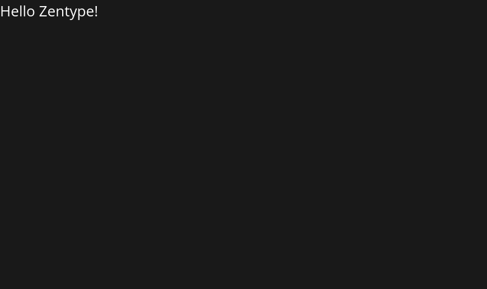
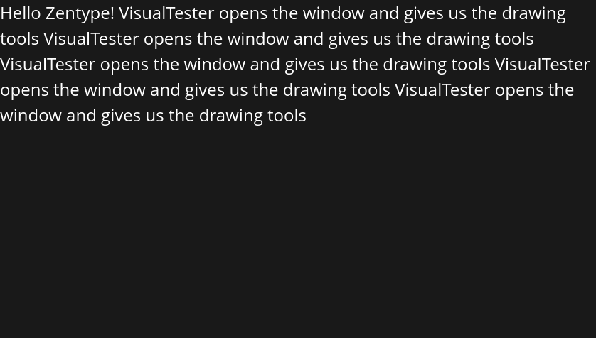

# Getting Started with Zentype

Welcome to Zentype! Our mission is to provide pixel-perfect, designer-grade typography for Rust applications with zero fuss.

## Basic Hello World

Rendering your first line of text is incredibly simple. Zentype handles the font loading and WGPU setup automatically.

```rust
use zentype::prelude::*;
use zentype::testing::VisualTester;

fn main() {
    VisualTester::run(|font_system, buffer| {
        // Set metrics (font size 32.0, line height 42.0)
        buffer.set_metrics(font_system, Metrics::new(32.0, 42.0));
        
        // Simple text input
        buffer.set_text(font_system, "Hello, Zentype!", &Attrs::new(), Shaping::Advanced, None);
        
        // Finalize layout
        buffer.shape_until_scroll(font_system, false);
    });
}
```



---

## Automatic Text Wrapping

Zentype isn't just for single labels—it's a full-featured engine that handles complex paragraph wrapping out of the box.

```rust
let text = "This is a long paragraph that stretches across the window \
            without any manual line breaks. Zentype handles the wrapping \
            automatically based on the window width.";

buffer.set_text(font_system, text, &Attrs::new(), Shaping::Advanced, None);
```



## What's Next?

- Explore [Background Highlights](./backgrounds.md)
- Learn about [Layout & Alignment](./alignment.md)
