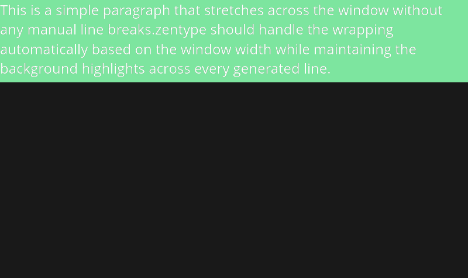
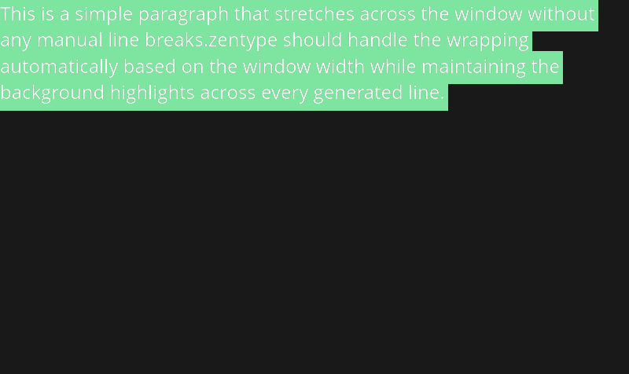

# Line Highlights & Backgrounds

Zentype provides a professional-grade background rendering system that ensures your text highlights are symmetric, balanced, and perfectly aligned within your window.

## The Symmetry Principle

Unlike basic text engines that often leave highlights looking lopsided, Zentype calculates padding **symmetrically** on all four sides. 

- **Uniformity**: The gap above, below, to the left, and to the right of the text is identical by default.
- **Vertical Balance**: The anchor point is calculated based on the visual center of the font, ensuring capital letters and symbols feel perfectly "nested" in the highlight.

```rust
let options = TextOptions::new()
    .bg(Color::GREEN)      
    .padding(50.0); // Perfect 50px of green on all sides
```

---

## Smart "Safe Areas"

Whenever you add padding to a Zentype highlight, the engine automatically creates a **Safe Area**. 

If you use `HorizontalAlignment::Right`, Zentype will calculate the text position so that the *padding* touches the edge of the window, not the text itself. This prevents your highlights from ever being clipped.

### **Vertical Mastery**
The same logic applies to `VerticalAlignment::Bottom`. Zentype ensures the highlight is flush with the window edge while maintaining perfect internal spacing.


---

## Full-Width vs. Chip Highlights

You can choose whether a highlight wraps tightly around the text ("Chip style") or spans the entire width of the container ("Editor style").

| Style | Code | Preview |
| :--- | :--- | :--- |
| **Full Width** | `.full_width(true)` |  |
| **Tight Chip** | `.full_width(false)` |  |

---

## 4-Way Fine Tuning

Need more breathing room on the sides? Zentype allows you to override the base padding on any axis.

```rust
let options = TextOptions::new()
    .bg(Color::GREEN)
    .padding(20.0)             // 20px top/bottom
    .padding_horizontal(60.0);  // 60px left/right
```
