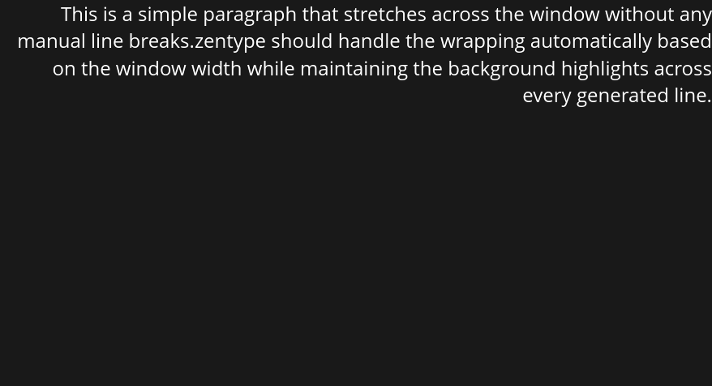

# Zentype Background Highlights & Alignment

Zentype provides a professional-grade background rendering system that ensures your text highlights are symmetric, balanced, and perfectly aligned within your window.

## Full Working Example

This example demonstrates a centered "Hero" text with symmetric green highlights using the new 4-way padding API.

```rust
use zentype::prelude::*;
use zentype::testing::VisualTester;
use cosmic_text::{Attrs, Shaping, Metrics};

fn main() {
    VisualTester::run(|font_system, buffer| {
        let text = "Symmetric Highlights";

        // 1. Set global metrics
        buffer.set_metrics(font_system, Metrics::new(32.0, 48.0));

        // 2. Configure background and alignment
        let options = TextOptions::new()
            .font_size(32.0)
            .bg(Color::GREEN)      
            .padding(20.0)                // Base padding on all sides
            .padding_horizontal(50.0)     // Extra breathing room on sides
            .align(HorizontalAlignment::Center) 
            .valign(VerticalAlignment::Center);

        // 3. Apply options to the buffer
        options.apply(font_system, buffer);

        // 4. Set and shape text
        buffer.set_text(font_system, text, &options.as_attrs(), Shaping::Advanced, None);
        buffer.shape_until_scroll(font_system, false);
    });
}
```

---

## 4-Way Padding & Symmetry

Zentype calculates padding **symmetrically** but independently on all four sides. You can use the `.padding()` shortcut for uniform space, or use specific methods to fine-tune the look.

| Method | Description |
| :--- | :--- |
| `.padding(f32)` | Sets all four sides equally. |
| `.padding_horizontal(f32)` | Sets Left and Right padding. |
| `.padding_vertical(f32)` | Sets Top and Bottom padding. |
| `.padding_left(f32)`, etc. | Sets a specific side independently. |

```rust
let options = TextOptions::new()
    .bg(Color::GREEN)      
    .padding_horizontal(60.0) // Wider highlights
    .padding_top(10.0);       // Tighter top space
```

---

## The "Safe Area" System

Zentype uses an intelligent **Safe Area** system. It automatically "insets" the rendering area based on your padding values. This ensures that your text never touches the window edges and your background highlights are **never clipped**, even when using `Right` or `Bottom` alignment.

---

## Alignment Support

| Method | Type | Options |
| :--- | :--- | :--- |
| `.align()` | `HorizontalAlignment` | `Left`, `Center`, `Right` |
| `.valign()` | `VerticalAlignment` | `Top`, `Center`, `Bottom` |

---

## Visual Reference

### **Horizontal: Right Alignment**
The text stops exactly at the padding edge before the right edge of the window.


### **Vertical: Bottom Alignment**
The highlight perfectly touches the bottom edge while maintaining internal symmetry.

